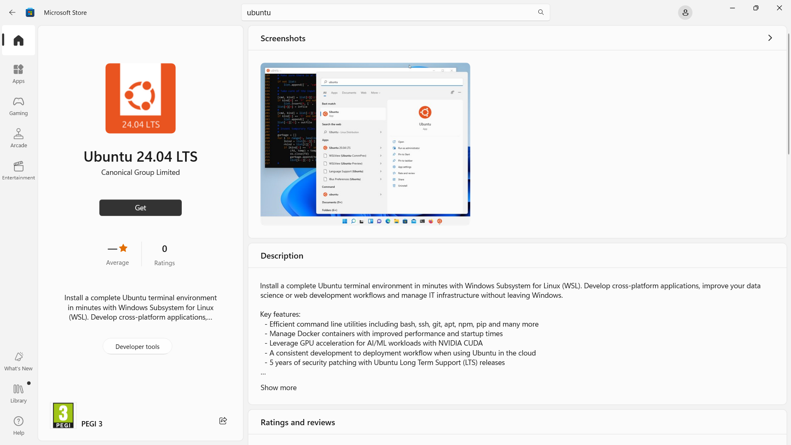
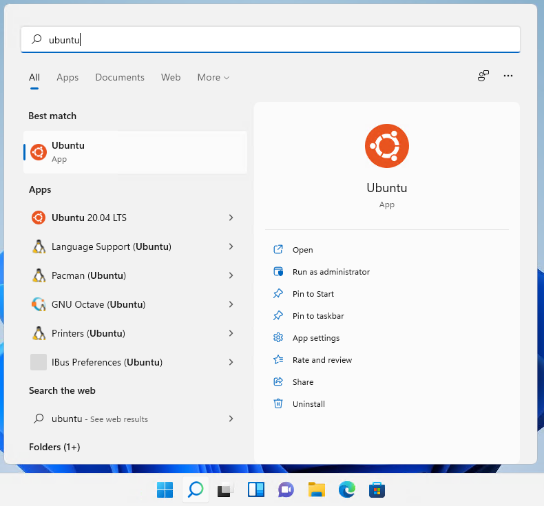
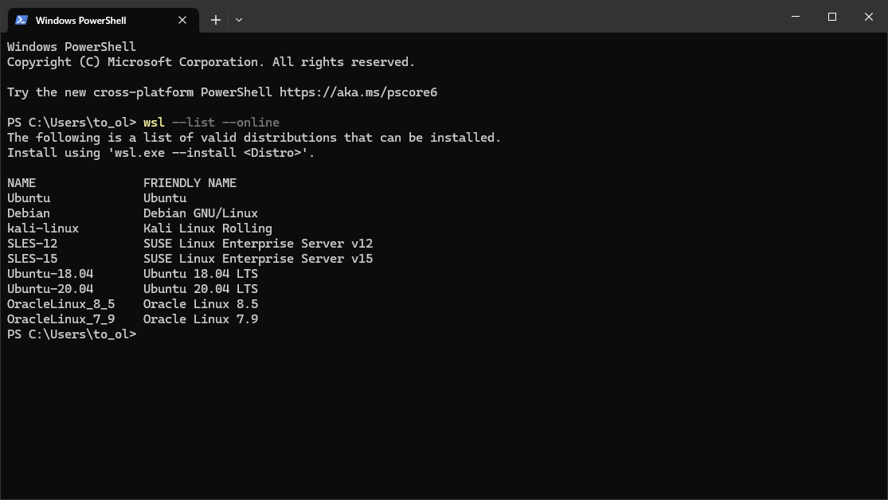
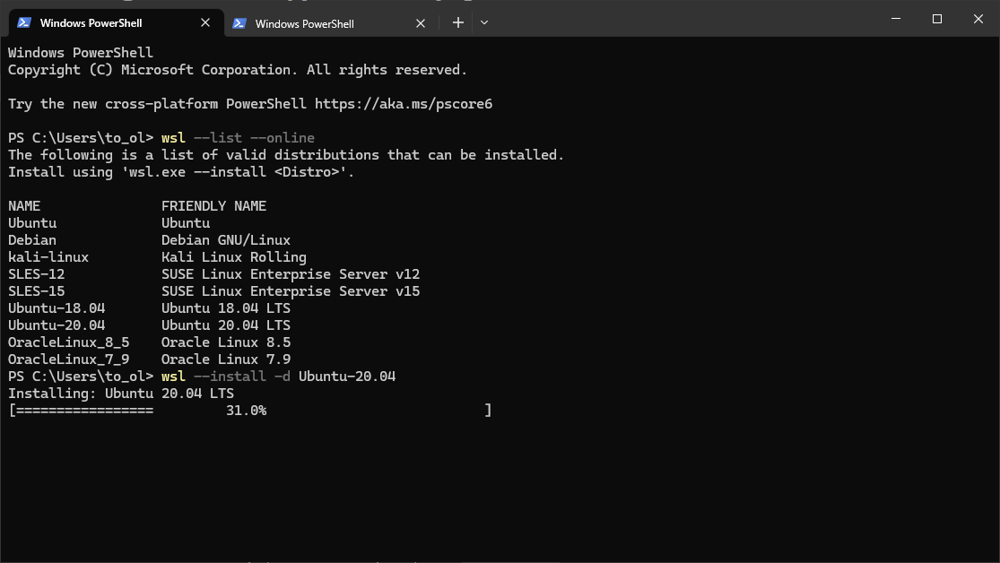
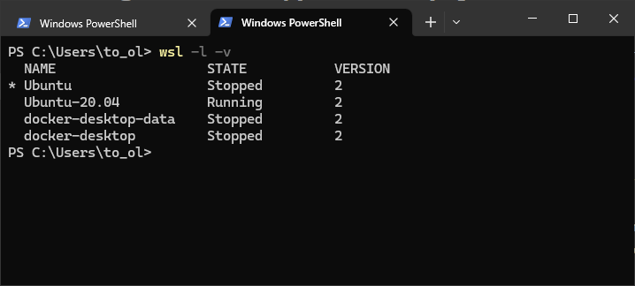

# Install Ubuntu on WSL2
*Authored by Oliver Smith ([oliver.smith@canonical.com](mailto:oliver.smith@canonical.com)) and edited by Edu Gómez Escandell ([edu.gomez.escandell@canonical.com](mailto:edu.gomez.escandell@canonical.com))*

## What you will learn:

* How to enable and install WSL on Windows 10 and Windows 11
* How to install and run a simple graphical application that uses WSLg
* How to install and run a much more advanced application that uses WSLg

## What you will need:

* A Windows 10 or Windows 11 physical or virtual machine with all the updates installed

## Install WSL

WSL can be installed from the command line. Open a PowerShell prompt as an Administrator (we recommend using Windows Terminal) and run:
```
wsl --install
```

This command will enable the features necessary to run WSL and also install the default Ubuntu distribution of Linux available in the Microsoft Store. It is recommended to reboot your machine after this initial installation to complete the setup. You can also install WSL from the Microsoft Store.

## Install Ubuntu WSL

WSL supports a variety of Linux distributions including the latest Ubuntu release. Check out [the documentation](../reference/distributions.md) to see which one you prefer. For the rest of this tutorial we'll use `Ubuntu` as the example.

There are multiple ways of installing distros on WSL, here we show three: via the Microsoft store, via Winget, and the WSL CLI. The result is equivalent.

### Method 1: Microsoft store

Find the distribution you prefer on the Microsoft Store and then select `Get`. 



Ubuntu will then be installed on your machine. Once installed, you can either launch the application directly from the store or search for Ubuntu in your Windows search bar.



### Method 2: WSL Command line interface

It is possible to install the same Ubuntu applications available on the Windows Store directly from the command line.
In a PowerShell terminal, you can run `wsl --list --online` to see all available distros.

 

You can install a distro using the NAME by running:
```
wsl --install -d Ubuntu-20.04
```

 

Use `wsl -l -v` to see all your currently installed distros and which version of WSL they are using:

 

### Method 3: Winget
Open a PowerShell terminal and type:
```powershell
winget show --name Ubuntu --source msstore
```

You'll see a list of distros available and their ID. Choose the one you prefer and install it. For instance, Ubuntu:
```powershell
winget install --Id "9PDXGNCFSCZV" --source msstore
```

You'll be prompted to accept the source and package agreements before installing. You need to accept them in order to proceed.

Check out [the documentation](../reference/distributions.md) to see which executable matches your application and run it.
```
ubuntu.exe
```

## Configure Ubuntu

Congratulations, you now have an Ubuntu terminal running on your Windows machine!

Once it has finished its initial setup, you will be prompted to create a username and password. They don't need to match your Windows user credentials.

Finally, it’s always good practice to install the latest updates with the following commands, entering your password when prompted.
```bash
sudo apt update
sudo apt full-upgrade -y
```
## Enjoy Ubuntu on WSL!

That’s it! In this tutorial, we’ve shown you how to install WSL and Ubuntu on Windows 11, set up your profile, install a few packages, and run a graphical application.

We hope you enjoy working with Ubuntu inside WSL. Don’t forget to check out [our blog](https://ubuntu.com/blog) for the latest news on all things Ubuntu.

### Further Reading
* [Advanced autoinstallation features](autoinstall.md)
* [Setting up WSL for Data Science](https://ubuntu.com/blog/upgrade-data-science-workflows-ubuntu-wsl)
* [Whitepaper: Ubuntu WSL for Data Scientists](https://ubuntu.com/engage/ubuntu-wsl-for-data-scientists)
* [Microsoft WSL Documentation](https://learn.microsoft.com/en-us/windows/wsl/)
* [Ask Ubuntu](https://askubuntu.com/)