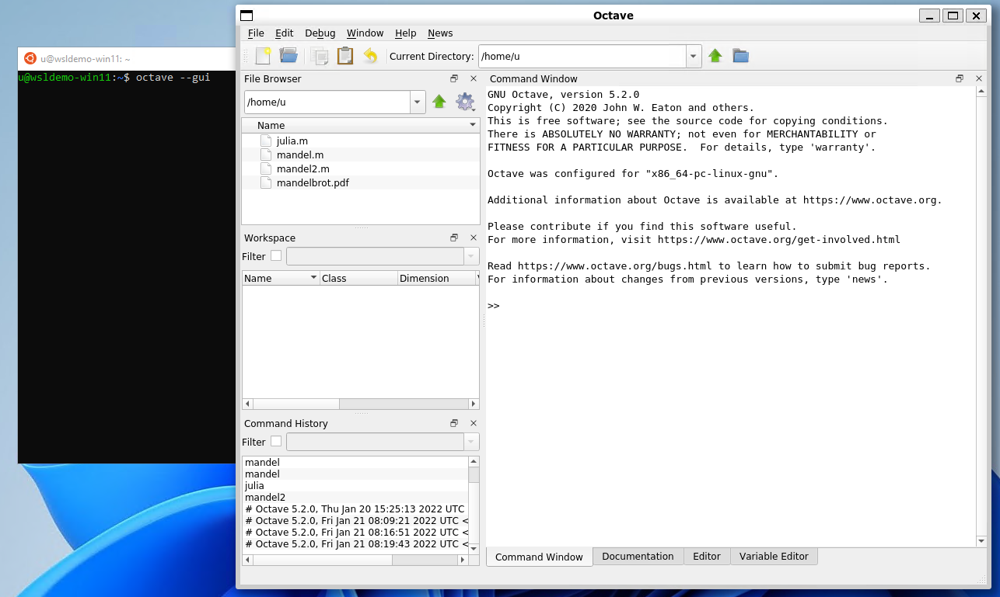
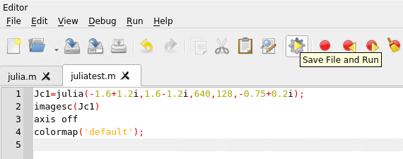

# Use WSL for data science and engineering
*Authored by Oliver Smith ([oliver.smith@canonical.com](mailto:oliver.smith@canonical.com)) and edited by Edu Gómez Escandell ([edu.gomez.escandell@canonical.com](mailto:edu.gomez.escandell@canonical.com))*

WSL is an ideal platform to run your Linux workflows while using your Windows machines. Here we show an example of how to set up GNU octave and run a toy program.

First, you'll need to set up Ubuntu on WSL, see [here](../guides/install-ubuntu-wsl2.md).

## GNU octave

> ⓘ GNU Octave is software featuring a [high-level programming language](https://en.wikipedia.org/wiki/High-level_programming_language), primarily intended for [numerical computations](https://en.wikipedia.org/wiki/Numerical_analysis). Octave helps in solving linear and nonlinear problems numerically, and for performing other numerical experiments using a language that is mostly compatible with [MATLAB](https://en.wikipedia.org/wiki/MATLAB). [[GNU / Octave](https://octave.org/about.html) ]

We will use it to calculate and draw a beautiful Julia fractal. The goal here is to use Octave to demonstrate how WSLg works, not to go through the theory of fractals. 

From an Ubuntu WSL terminal prompt run:

```{code-block} text
$ sudo apt update
$ sudo apt install -y octave
```

Then start the application:

```{code-block} text
$ octave --gui &
```

Do not forget the ampersand `&` at the end of the line, so the application is started in the background and we can continue using the same terminal window.



In Octave, click on the `New script` icon to open a new editor window and copy/paste the following code:

```{code-block} octave
#{
Inspired by the work of Bruno Girin ([Geek Thoughts: Fractals with Octave: Classic Mandelbrot and Julia](http://brunogirin.blogspot.com/2008/12/fractals-with-octave-classic-mandelbrot.html))
Calculate a Julia set
zmin: Minimum value of c
zmax: Maximum value of c
hpx: Number of horizontal pixels
niter: Number of iterations
c: A complex number
#}
function M = julia(zmin, zmax, hpx, niter, c)
    %% Number of vertical pixels
    vpx=round(hpx*abs(imag(zmax-zmin)/real(zmax-zmin)));
    %% Prepare the complex plane
    [zRe,zIm]=meshgrid(linspace(real(zmin),real(zmax),hpx),
    linspace(imag(zmin),imag(zmax),vpx));
    z=zRe+i*zIm;
    M=zeros(vpx,hpx);
    %% Generate Julia
    for s=1:niter
        mask=abs(z)<2;
        M(mask)=M(mask)+1;
        z(mask)=z(mask).^2+c;
    end
    M(mask)=0;
end
```

This code is the function that will calculate the Julia set. Save it to a file named `julia.m`. Since it is a function definition, the name of the file must match the name of the function.

Open a second editor window with the New Script button and copy and paste the following code:

```{code-block} octave
Jc1=julia(-1.6+1.2i, 1.6-1.2i, 640, 128, -0.75+0.2i);
imagesc(Jc1)
axis off
colormap('default');
```

This code calls the function defined in `julia.m`. You can later change the parameters if you want to explore the Julia fractal.

Save it to a file named `juliatest.m`.

And finally, press the button **Save File and Run**.



After a few seconds, depending on your hardware and the parameters, a Julia fractal is displayed.


Like Octave, this window is displayed using WSLg completely transparently to the user.

Enjoy!

### Further Reading
* [An introduction to numerical computation applications using Ubuntu WSL](https://www.youtube.com/watch?v=08WDGV0u58Y)
* [Setting up WSL for Data Science](https://ubuntu.com/blog/upgrade-data-science-workflows-ubuntu-wsl)
* [Whitepaper: Ubuntu WSL for Data Scientists](https://ubuntu.com/engage/ubuntu-wsl-for-data-scientists)
* [Microsoft WSL Documentation](https://learn.microsoft.com/en-us/windows/wsl/)
* [Ask Ubuntu](https://askubuntu.com/)
