# Run a .Net Echo Bot as a systemd service on Ubuntu WSL
*Authored by Oliver Smith ([oliver.smith@canonical.com](mailto:oliver.smith@canonical.com))*

.Net is an open-source development platform from Microsoft that enables developers to build multi-platform applications from a single codebase.

In this tutorial we demonstrate how easy it is to start working with .Net on Ubuntu WSL by creating a simple chatbot accessible from your Windows host. We also take advantage of WSL's new systemd support to run our bot as a systemd service for easier deployment.

## Requirements

* A PC running Windows 11
* The latest version of the WSL Windows Store application
* Ubuntu, Ubuntu 22.04 LTS or Ubuntu Preview installed

Systemd support is a new feature of WSL and only available on WSL version XX or higher.

You can check your current WSL version by running:

> `> wsl -- version`

In your PowerShell terminal.

To enable systemd on your Ubuntu distribution you need to add the following content to `/etc/wsl.conf`​:

> `[boot]`
> `systemd=true`

Make sure to restart your distribution after you have made this change.

## Install .Net

.Net has recently [been added to the Ubuntu repositories](https://ubuntu.com/blog/install-dotnet-on-ubuntu). This means you can now quickly install a bundle with both the SDK and runtime with a single command:

>`$ sudo apt install dotnet6`

Run `dotnet --version` to confirm that the package was installed successfully.

It is recommended to create a new directory for this project, do so now and navigate to it before proceeding:

>`$ sudo mkdir ~/mybot`
>`$ cd mybot`

## Install and run the Bot Framework EchoBot template

Create a new directory for the project and navigate to it before proceeding:

>`$ sudo mkdir ~/mybot`
>`$ cd mybot`

Once inside we can install the EchoBot C# template by running:

>`$ dotnet new -i Microsoft.Bot.Framework.CSharp.EchoBot`

We can verify the template has been installed correctly by running:

>`$ dotnet new --list`

And looking for the `Bot Framework Echo Bot` template in the list.

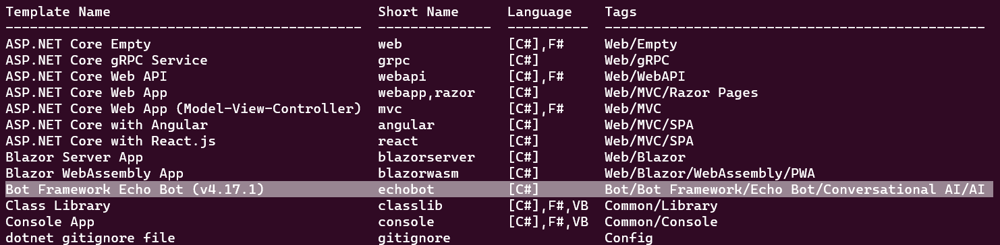

Create a new Echo Bot project using the following command. We use `echoes` as the name for our bot.

>`$ dotnet new echobot -n echoes`

Once this has completed we can navigate into the new directory that has been created.

>`$ cd ~/mybot/echoes`

Once inside, the project should be ready to run. Test it with:

>`$ sudo dotnet run`

If everything was set up correctly you should see a similar output to the one below:

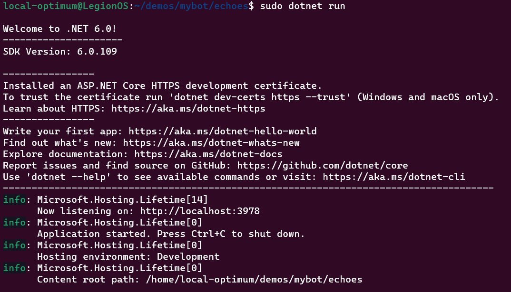

Leave the EchoBot App running in WSL for now. Open a new browser window on your Windows host and navigate to `localhost:3978` where you should see the following window:

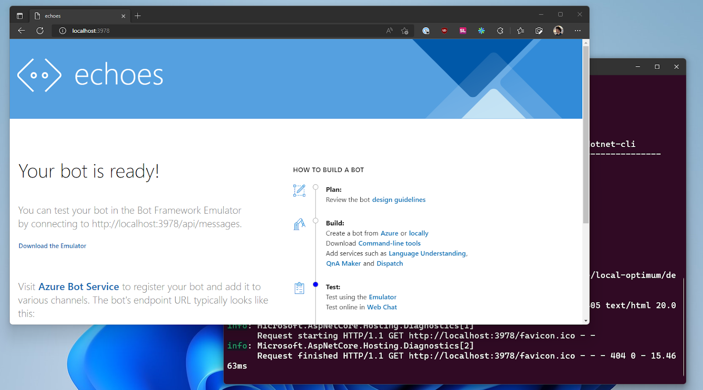

Leave everything running as we move to the next step.

## Install the Bot Emulator on Windows and connect to your bot

Download the Bot Emulator from the official [Microsoft GitHub](https://github.com/Microsoft/BotFramework-Emulator/releases/tag/v4.14.1), taking care to select [BotFramework-Emulator-4.14.1-windows-setup.exe](https://github.com/microsoft/BotFramework-Emulator/releases/download/v4.14.1/BotFramework-Emulator-4.14.1-windows-setup.exe) and install.

Running it will present you with the following screen, but before you can connect to your bot you need to change a few settings.

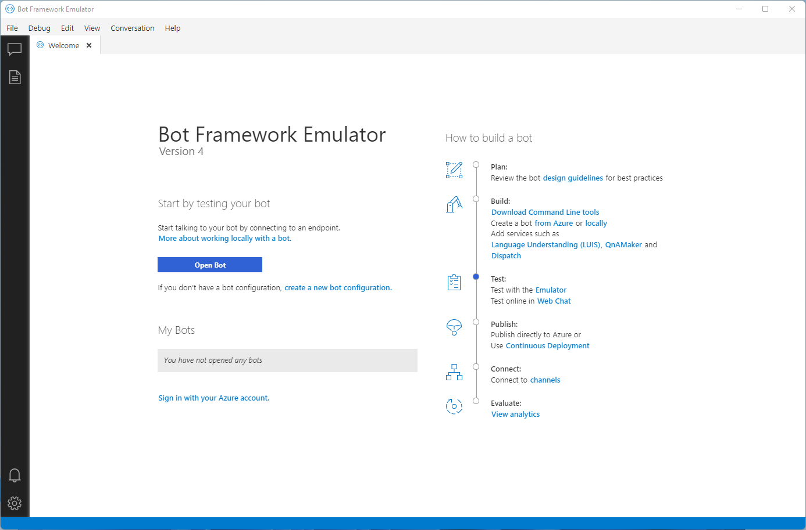

First, get the IP address of your machine by running `ipconfig` in a PowerShell terminal.

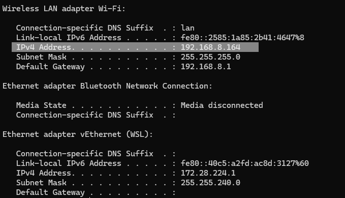

Then select the setting icon in the corner of the Bot Framework Emulator and enter your IP under ‘localhost override'.

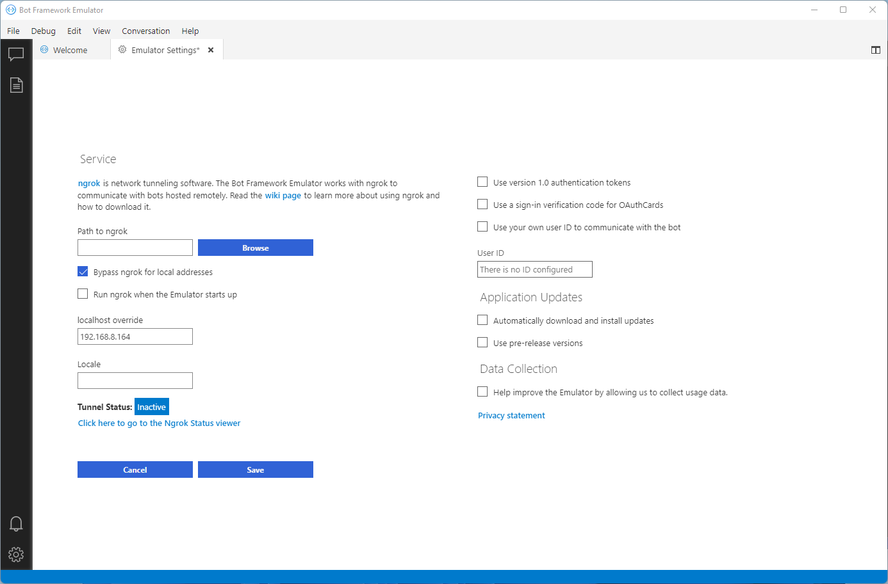

Click save and navigate back to the Welcome tab.

Click ‘Open Bot’ and under ‘Bot URL’ input:
```
http://localhost:3978/api/messages
```

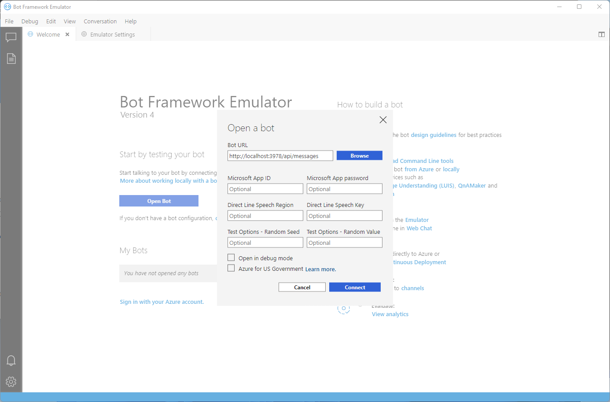

And click ‘Connect’ to connect to your Echo Bot running in WSL and start chatting!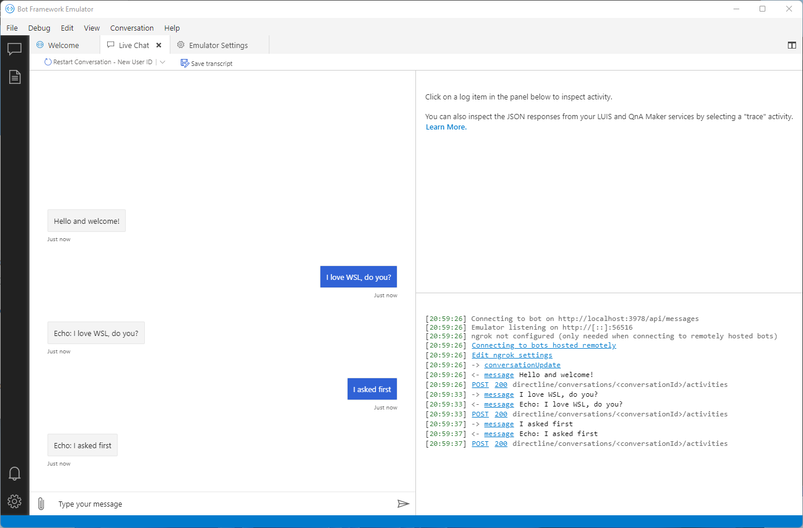

Congratulations, your Echo Chat Bot App is running on Ubuntu WSL as an App. Now it is time to make it run as a service.

## Running your Echo Bot as a systemd service

Return to your running WSL distro and end the app with `Ctrl+C`.

Then install the .Net systemd extension with:

>`$ sudo dotnet add package Microsoft.Extensions.Hosting.Systemd`

Now we need to open our ‘echoes’ project in VS Code by running:

>`$ code .`

From the ‘echoes’ directory.

Navigate to ‘Program.cs’ and insert `.UserSystemd()` as a new line in the location shown in the screenshot.

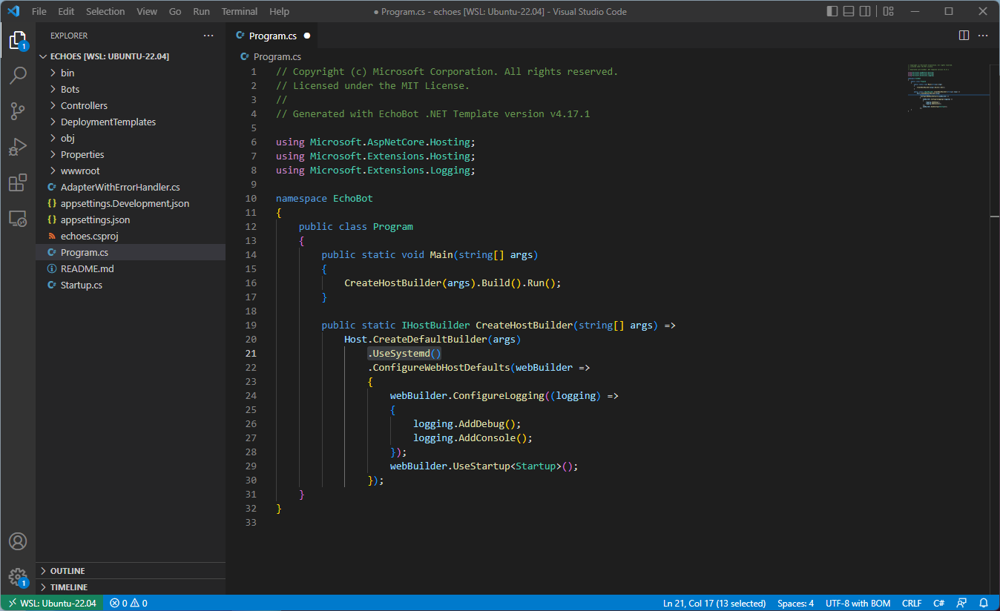

Save and close the project in VS code and return to your WSL terminal.

Next we need to create a service file for your bot using your favourite editor, for example.

>`$ sudo nano /etc/systemd/system/echoes.service`

Then paste the below taking care to change the path of `WorkingDirectory` to the location of your project folder.

```
[Unit]
Description=The first ever WSL Ubuntu systemd .NET ChatBot Service

[Service]
WorkingDirectory=/home/local-optimum/demos/mybot/echoes
Environment=DOTNET_CLI_HOME=/temp
ExecStart=dotnet run
SyslogIdentifier=echoes

[Install]
WantedBy=multi-user.target
```

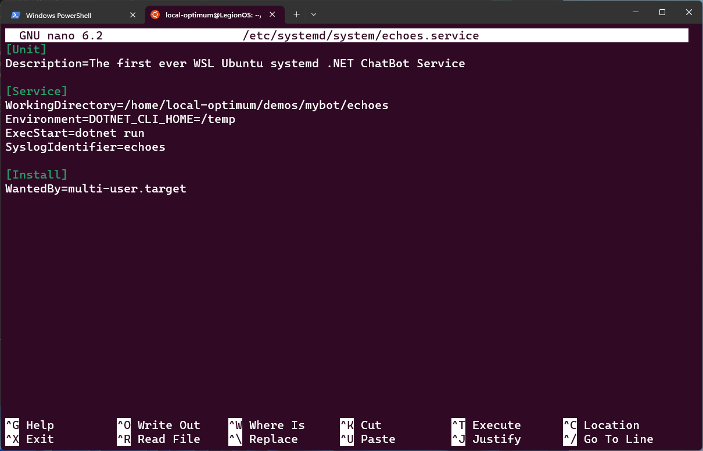

Save your file and reload your services with:

>`$ sudo systemctl daemon-reload`

To reload the services. You can check if your service is ready by running:

>`$ systemctl status echoes.service`

You should get the following output:

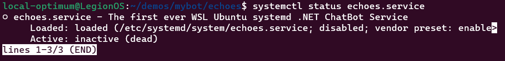

Now start your service and then check its status again.

>`$ sudo systemctl start echoes.service`
>`$ sudo systemctl status echoes.service`

If everything has been configured correctly you should get an output similar to the below.

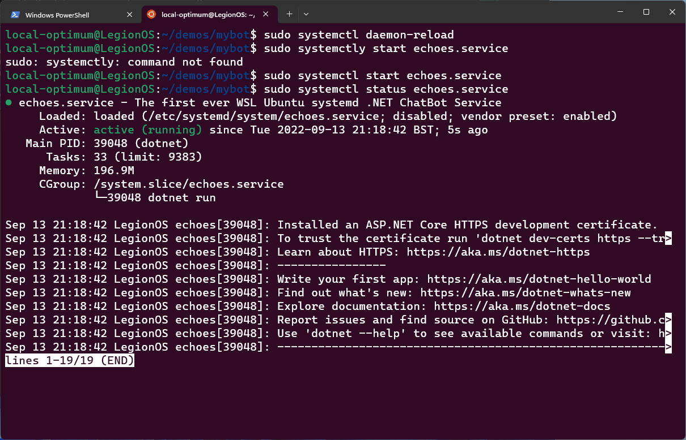

Return to your Windows host and reconnect to your Bot Emulator using the same information as before and confirm that your bot is running, but this time as a systemd service!

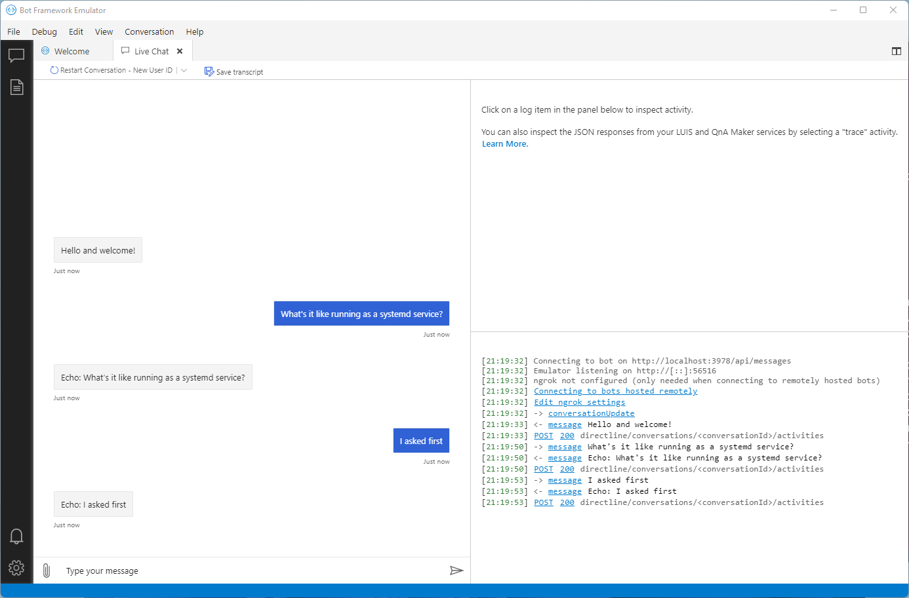

You can stop your bot from running at any time with the command:

>`$ sudo systemctl stop echoes.service`

## Tutorial complete!

You now have a simple Echo Bot running as a systemd service on WSL that you can access from your host Windows machine.

If you would like to expand on this example try reviewing some of the more advanced [Bot Framework samples](https://github.com/Microsoft/BotBuilder-Samples/blob/main/README.md) on the Microsoft GitHub.

To read more about how Ubuntu supports .Net developers, making it easier than ever to build multi-platform services and applications, read our [recent announcement](https://ubuntu.com/blog/install-dotnet-on-ubuntu).

### Further Reading

* [.Net on Ubuntu](https://ubuntu.com/blog/install-dotnet-on-ubuntu)
* [Bot Framework samples](https://github.com/Microsoft/BotBuilder-Samples/blob/main/README.md)
* [Enabling GPU acceleration on Ubuntu on WSL2 with the NVIDIA CUDA Platform](gpu-cuda.md)
* [Windows and Ubuntu interoperability on WSL2](interop.md)
* [Microsoft WSL Documentation](https://learn.microsoft.com/en-us/windows/wsl/)
* [Ask Ubuntu](https://askubuntu.com/)