# Enabling GPU acceleration with the NVIDIA CUDA Platform
*Authored by Carlos Nihelton ([carlos.santanadeoliveira@canonical.com](mailto:carlos.santanadeoliveira@canonical.com))*

While WSL's default setup allows you to develop cross-platform applications without leaving Windows, enabling GPU acceleration inside WSL provides users with direct access to the hardware. This provides support for GPU-accelerated AI/ML training and the ability to develop and test applications built on top of technologies, such as OpenVINO, OpenGL, and CUDA that target Ubuntu while staying on Windows.

## What you will learn

* How to install a Windows graphical device driver compatible with WSL2
* How to install the NVIDIA CUDA toolkit for WSL 2 on Ubuntu
* How to compile and run a sample CUDA application on Ubuntu on WSL2

## What you will need

* A Windows 10 version 21H2 or newer physical machine equipped with an NVIDIA graphics card and administrative permission to be able to install device drivers
* Ubuntu on WSL2 previously installed
* Familiarity with Linux command line utilities and interacting with Ubuntu on WSL2

> ⓘ Note: If you need more introductory topics, such as how to install Ubuntu on WSL, refer to previous tutorials that can be found [here](../guides/install-ubuntu-wsl2.md).


## Prerequisites

The following steps assume a specific hardware configuration. Although the concepts are essentially the same for other architectures, different hardware configurations will require the appropriate graphics drivers and CUDA toolkit.

Make sure the following prerequisites are met before moving forward:

* A physical machine with Windows 10 version 21H2 or higher
* NVIDIA’s graphic card
* Ubuntu 20.04 or higher installed on WSL 2
* Broadband internet connection able to download a few GB of data

## Install the appropriate Windows vGPU driver for WSL

> ⓘ Specific drivers are needed to enable use of a virtual GPU, which is how Ubuntu applications are able to access your GPU hardware, so you’ll need to follow this step even if your system drivers are up-to-date.

Please refer to the official [WSL documentation](https://learn.microsoft.com/en-us/windows/wsl/tutorials/gui-apps) for up-to-date links matching your specific GPU vendor. You can find these in `Install support for Linux GUI apps > Prerequisites` . For this example, we will download the `NVIDIA GPU Driver for WSL`.

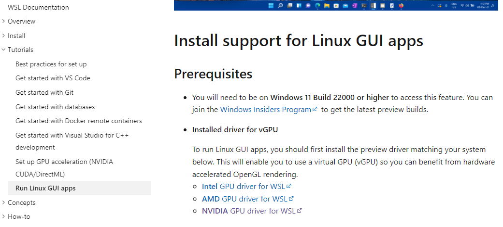

> ⓘ **Note:** This is the only device driver you’ll need to install. Do not install any display driver on Ubuntu.

Once downloaded, double-click on the executable file and click `Yes` to allow the program to make changes to your computer.

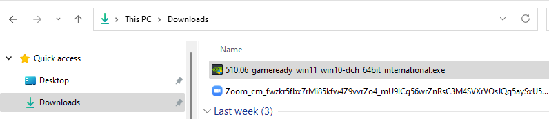

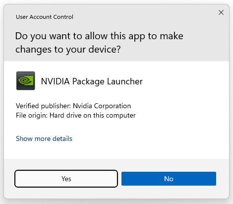

Confirm the default directory and allow the self-extraction process to proceed.

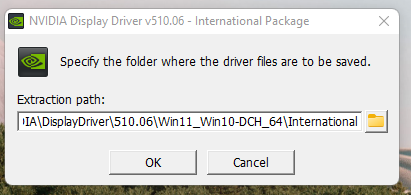

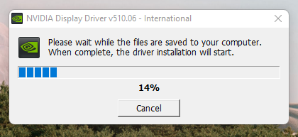

A splash screen appears with the driver version number and quickly turns into the main installer window. Read and accept the license terms to continue.

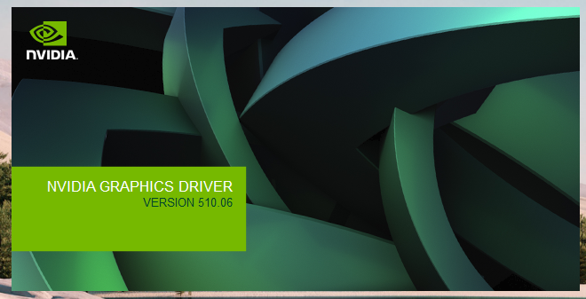

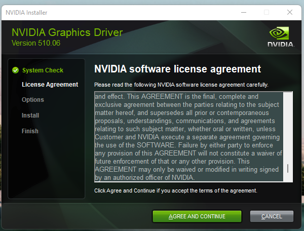

Confirm the wizard defaults by clicking `Next` and wait until the end of the installation. You might be prompted to restart your computer.

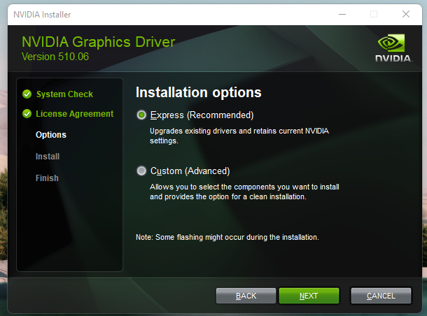

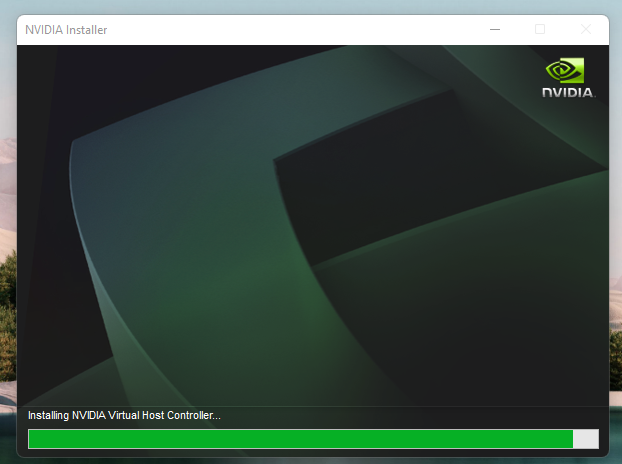

This step ends with a screen similar to the image below.

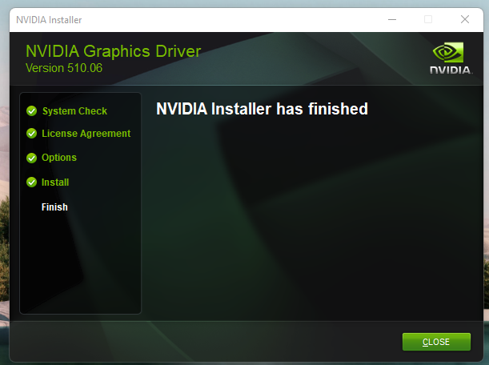

## Install NVIDIA CUDA on Ubuntu

> ⓘ Normally, CUDA toolkit for Linux will have the device driver for the GPU packaged with it. On WSL 2, the CUDA driver used is part of the Windows driver installed on the system, and, therefore, care must be taken `not` to install this Linux driver as previously mentioned.

The following commands will install the WSL-specific CUDA toolkit version 11.6 on Ubuntu 22.04 AMD64 architecture. Be aware that older versions of CUDA (<=10) don’t support WSL 2. Also notice that attempting to install the CUDA toolkit packages straight from the Ubuntu repository (`cuda`, `cuda-11-0`, or `cuda-drivers`) will attempt to install the Linux NVIDIA graphics driver, which is not what you want on WSL 2. So, first remove the old GPG key:

```{code-block} text
sudo apt-key del 7fa2af80
```

Then setup the appropriate package for Ubuntu WSL with the following commands:

```{code-block} text
wget https://developer.download.nvidia.com/compute/cuda/repos/wsl-ubuntu/x86_64/cuda-wsl-ubuntu.pin

sudo mv cuda-wsl-ubuntu.pin /etc/apt/preferences.d/cuda-repository-pin-600

sudo apt-key adv --fetch-keys https://developer.download.nvidia.com/compute/cuda/repos/wsl-ubuntu/x86_64/3bf863cc.pub

sudo add-apt-repository 'deb https://developer.download.nvidia.com/compute/cuda/repos/wsl-ubuntu/x86_64/ /'

sudo apt-get update

sudo apt-get -y install cuda
```

Once complete, you should see a series of outputs that end in `done.`:


Congratulations! You should have a working installation of CUDA by now. Let’s test it in the next step.

## Compile a sample application

NVIDIA provides an open source repository on GitHub with samples for CUDA Developers to explore the features available in the CUDA Toolkit. Building one of these is a great way to test your CUDA installation. Let’s choose the simplest one just to validate that our installation works.

Let’s say you have a `~/Dev/` directory where you usually put your working projects. Navigate inside the directory and `git clone` the [cuda-samples repository](https://github.com/nvidia/cuda-samples):

```{code-block} text
cd ~/Dev
git clone https://github.com/nvidia/cuda-samples
```

To build the application, go to the cloned repository directory and run `make`:

```{code-block} text
cd ~/Dev/cuda-samples/Samples/1_Utilities/deviceQuery
make
```

A successful build will look like the screenshot below.

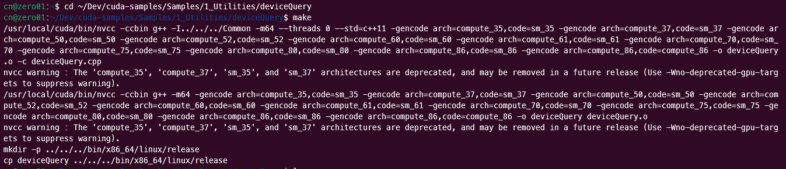

Once complete, run the application with:

```{code-block} text
./deviceQuery
```

You should see a similar output to the following detailing the functionality of your CUDA setup (the exact results depend on your hardware setup):

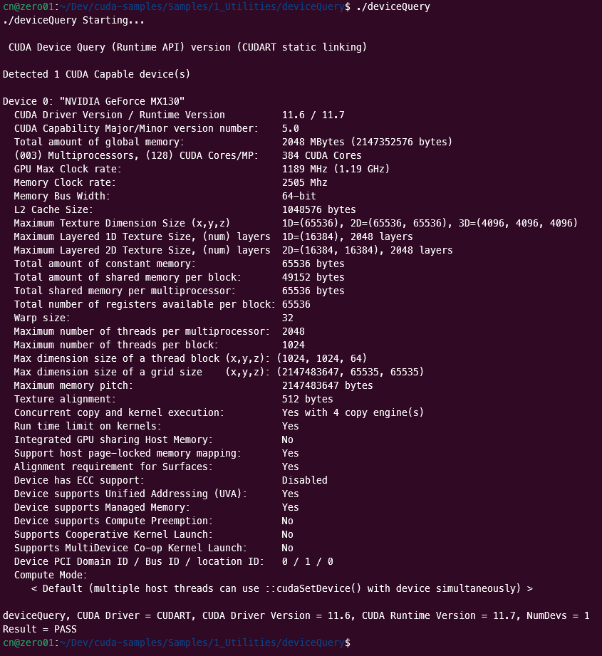

## Enjoy Ubuntu on WSL!

That’s all folks! In this tutorial, we’ve shown you how to enable GPU acceleration on Ubuntu on WSL 2 and demonstrated its functionality with the NVIDIA CUDA toolkit, from installation through to compiling and running a sample application.

We hope you enjoy using Ubuntu inside WSL for your Data Science projects. Don’t forget to check out [our blog](https://ubuntu.com/blog) for the latest news on all things Ubuntu.

### Further Reading

* [Setting up WSL for Data Science](https://ubuntu.com/blog/wsl-for-data-scientist)
* [Ubuntu WSL for Data Scientists Whitepaper](https://ubuntu.com/engage/ubuntu-wsl-for-data-scientists)
* [NVIDIA's CUDA Post Installation Actions](gpu-cuda.md)
* [Install Ubuntu on WSL2](../guides/install-ubuntu-wsl2.md)
* [Microsoft WSL Documentation](https://learn.microsoft.com/en-us/windows/wsl/)
* [Ask Ubuntu](https://askubuntu.com/)
