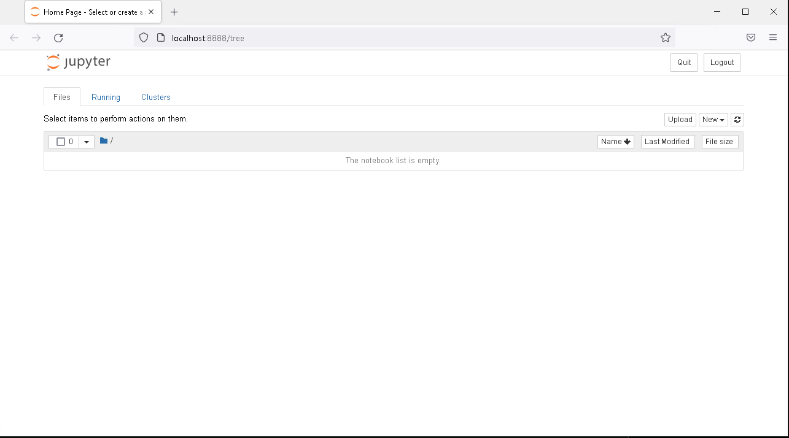
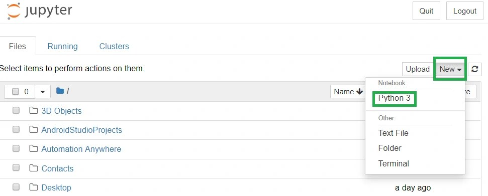
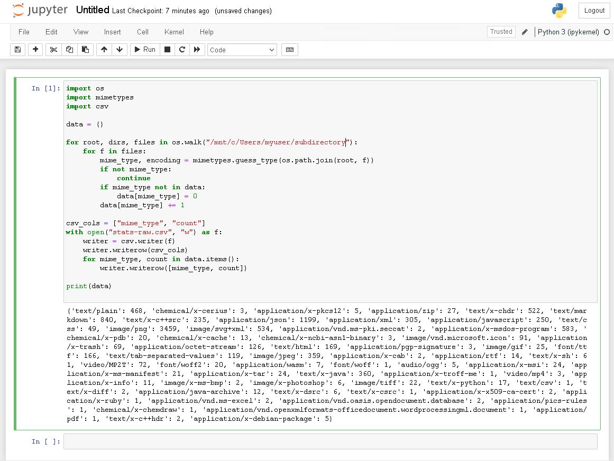
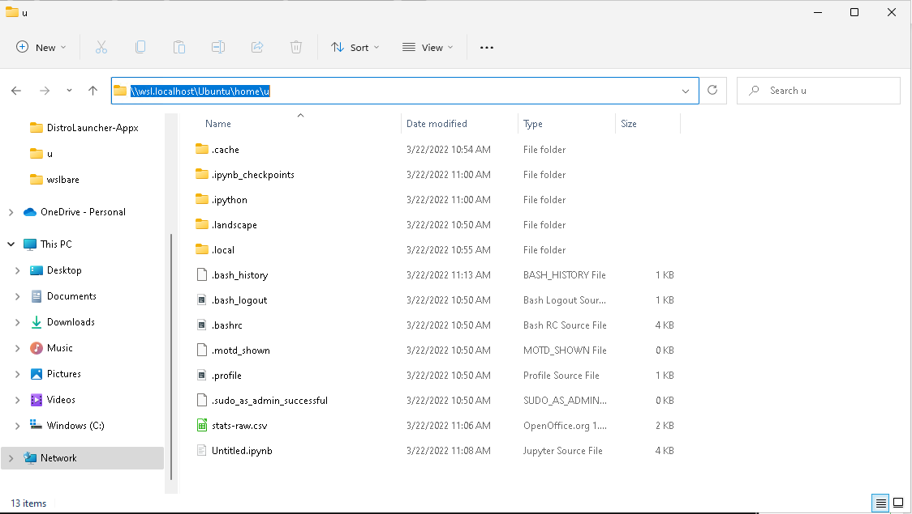
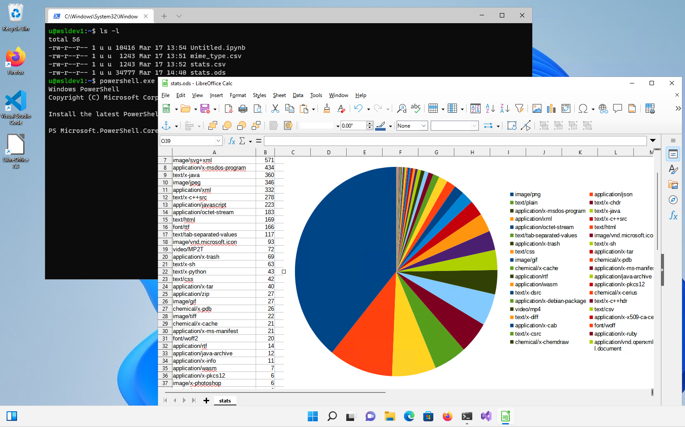

# Windows and Ubuntu interoperability
*Authored by Didier Roche-Tolomelli ([didier.roche@canonical.com](mailto:didier.roche@canonical.com))*

Some tools used during the development process are only available or are performed best on one platform and transferring data from one system to another to visualise or share can be tedious. WSL solves this problem with a feature called `interoperability`.

Interoperability is the ability to transparently execute commands and applications, share files, network and environment variables across Windows and Ubuntu.

We’ll illustrate all these notions by generating data from your Ubuntu WSL instance using your Windows user profile directory, perform some transformations via PowerShell scripts, and finally, visualise those on Windows. We are going to cross the chasm between the two worlds not just once, but many times, seamlessly!

## What you will learn:

* How to access a service provided by a web server running on your Ubuntu WSL instance from Windows.
* Share environment variables between Windows and Ubuntu, back and forth.
* Access files across filesystems, and discover where they are located on both sides.
* Run Windows commands (command line and graphical) from your WSL instance and chain them.

## What you will need:

* Know how to use command line tools on Windows or Linux.
* A PC with Windows 10 or 11.
* Optional: [LibreOffice](https://www.libreoffice.org/download/download-libreoffice/) or MS Excel to visualise and manipulate generated data from Ubuntu.

## Install Ubuntu on WSL2

This tutorial assumes that you already have WSL2 installed with the latest LTS release of Ubuntu.

If not, check out our getting started tutorial for Windows 10 and Windows 11:

* [Install Ubuntu on WSL2 on Windows 10 and Windows 11 with GUI support](install-ubuntu-wsl2.md)

For this tutorial, we will assume that you have installed the [Ubuntu](https://www.microsoft.com/en-us/p/ubuntu/9pdxgncfsczv?rtc=1&activetab=pivot:overviewtab) main WSL application.

Once you have completed the relevant tutorial, the following steps will work on either Windows 10 or 11.

Note: in this tutorial, we consider that interoperability is turned on in WSL.conf, which is the default behaviour. If you have disabled it, you can either use the ubuntu reconfiguration tool on Ubuntu 22.04+, or, for earlier versions, directly modify back `wsl.conf` yourself as described on [wsl.conf documentation](https://learn.microsoft.com/en-us/windows/wsl/wsl-config). The settings you are interested in are `[Interop]`: `enabled` and `appendWindowsPath` both set to true (or not being present, which defaults to true).

## Share ports between WSL and Windows

### Install Jupyter notebook on WSL.

Let’s install [Jupyter notebook](https://jupyter.org/), a web-based interactive computing platform where we will generate some statistics.

1. Start our WSL instance, on a terminal, using Ubuntu:

> $ ubuntu.exe

2. Install the python package manager [pip](https://pypi.org/project/pip/):

```

$ sudo apt update

$ sudo apt install python3-pip

```

3. Get Jupyter notebook installed via pip:

> $ pip install notebook

### Executing Jupyter notebook.

Finally, let’s start Jupyter, by adding it to the user PATH first:

```
$ export PATH=$PATH:~/.local/bin
$ jupyter notebook --no-browser
[I 10:52:23.760 NotebookApp] Writing notebook server cookie secret to /home/u/.local/share/jupyter/runtime/notebook_cookie_secret
[I 10:52:24.205 NotebookApp] Serving notebooks from local directory: /home/u
[I 10:52:24.205 NotebookApp] Jupyter Notebook 6.4.10 is running at:
[I 10:52:24.205 NotebookApp] http://localhost:8888/?token=1d80ee69da6238f22bb683a4acd00025d32d15dde91cbdf4
[I 10:52:24.205 NotebookApp] or http://127.0.0.1:8888/?token=1d80ee69da6238f22bb683a4acd00025d32d15dde91cbdf4
[I 10:52:24.205 NotebookApp] Use Control-C to stop this server and shut down all kernels (twice to skip confirmation).
[C 10:52:24.209 NotebookApp]
To access the notebook, open this file in a browser:
file:///home/u/.local/share/jupyter/runtime/nbserver-5744-open.html
Or copy and paste one of these URLs:
http://localhost:8888/?token=1d80ee69da6238f22bb683a4acd00025d32d15dde91cbdf4
or http://127.0.0.1:8888/?token=1d80ee69da6238f22bb683a4acd00025d32d15dde91cbdf4
[I 10:53:03.628 NotebookApp] 302 GET / (127.0.0.1) 0.600000ms
[I 10:53:03.633 NotebookApp] 302 GET /tree? (127.0.0.1) 1.040000ms
```

If you look closely at the output, you will see that the Jupyter notebook is now running, and its interface is exposed via its internal web server on localhost, port 8888.

### Accessing port 8888

This port can be accessed directly from our Ubuntu WSL instance via curl, lynx (a command line web browser), or any GUI web browser executed in WSL.

However, this tutorial is not about running Linux GUI applications from WSL (which you can do), or visualising data in the command line, but interoperability! So, as you can guess, any network port exposed locally is also available from Windows directly, if no conflict occurs.

Let’s try this right away: from Windows, launch a web browser and enter the `URL printed above` with the corresponding token, for example: `http://localhost:8888/?token=1d80ee69da6238f22bb683a4acd00025d32d15dde91cbdf4`.



And it works! You can thus easily expose and share any services that are using network ports between your Windows machine and WSL instances!

>ⓘ **Note:** you need to keep this command line Window opened to have your Jupyter instance running. If you close it, the service will shut down and you won’t have access to it anymore. Other command-line operations in the same WSL instance should be done on another terminal.

## Get access to Windows environment variables on WSL

Our next step is to be able to generate some statistics on our Windows user personal directory. For Jupyter to access those, we need to know how to get access from our Ubuntu instance to the Windows partition(s). You may already know about it by reading documentation or blog posts, but let’s do something even cooler: let’s discover it by using environment variables!

On another terminal, under PowerShell, let’s first check our Windows user profile directory:

```
PS C:\Users\myuser> echo $env:USERPROFILE
C:\Users\myuser
```

Let’s share it with Ubuntu by setting `WSLENV`:

```
PS C:\Users\myuser> $env:WSLENV="USERPROFILE"
PS C:\Users\myuser> ubuntu.exe
$ echo $USERPROFILE
C:\Users\myuser
```

Awesome! Setting `WSLENV="ENVVAR1:ENVVAR2:…"` allows us to share multiple environment variables from Windows to our Ubuntu instance. We can then retrieve the value under Ubuntu.

However, you may notice that the environment variable value was shared as is, which is fine in most cases but not for path-related content. Let’s check:

```
$ ls 'C:\Users\myuser'
ls: cannot access 'C:\Users\myuser': No such file or directory
```

Indeed, `C:\Users\myuser` is not a compatible Linux-path where the Windows file system is located under WSL.

But we haven’t done all that for nothing! `WSLENV` variable declaration can be suffixed with `/p`, which then translates any paths between Windows and your Linux instance.

Let’s try again:

```
$ exit
PS C:\Users\myuser> $env:WSLENV="USERPROFILE/p"
PS C:\Users\myuser> ubuntu.exe
$ echo $USERPROFILE
/mnt/c/Users/myuser
$ ls /mnt/c/Users/myuser
AppData
'Application Data'
Contacts
Cookies
Desktop
[…]
```

And here we go! We now know where our user profile data is accessible on WSL thanks to environment variables sharing. But more generally, environment variables could be used in your scripts, or any services in your WSL instance, where parameters are controlled from Windows.

Going further:

* There are many other flags available for environment variables sharing via `WSLENV`. Check out the reference section to have a look at some handy links explaining each of them.
* The place where your Windows filesystems are mounted can vary depending on your configuration. This can be changed with our configuration tool on Ubuntu 22.04+ or by modifying the `automount` section [in wsl.conf](https://learn.microsoft.com/en-us/windows/wsl/wsl-config).

With this, we are now ready to generate some statistics on your Windows user profile directory from our WSL instance!

## Accessing Windows file from Ubuntu to run our script

After this little detour into the command line world to discover which path to use, let’s go back to our Jupyter interface in our browser running on Windows.

We are going to create a `stats-raw.csv` file, containing statistics about our user profile directory.

Some preliminary warnings: accessing Windows filesystem from Ubuntu is using the [9P protocol](https://en.wikipedia.org/wiki/9P_(protocol)), which might mean slower access and indexing of files than native performance. So that this section doesn’t take too long to complete, we are advising you to choose a subdirectory or your Windows user profile directory, with fewer files and directories to run over. We will call it here `/mnt/c/Users/mysuser/path/my/subdirectory`.

From the Jupyter main screen, create a new notebook to start developing an interactive Python solution. You can do this by clicking on the `New` button, and then clicking on the `Python 3` option, as we can see below.



Copy this to the first cell, adapting the input directory:

```python
import os
import mimetypes
import csv

data = {}

for root, dirs, files in os.walk("/mnt/c/Users/mysuser/path/my/subdirectory"):
  for f in files:
    mime_type, encoding = mimetypes.guess_type(os.path.join(root, f))
    if not mime_type:
      continue
    if mime_type not in data:
      data[mime_type] = 0
      data[mime_type] += 1
      csv_cols = ["mime_type", "count"]

with open("stats-raw.csv", "w") as f:
  writer = csv.writer(f)
  writer.writerow(csv_cols)
  for mime_type, count in data.items():
    writer.writerow([mime_type, count])

print(data)
```

This script will enumerate all files under `/mnt/c/Users/mysuser/path/my/subdirectory`, get the mime types of each entry, and count them. It will write the result in your Ubuntu user home directory as a [Comma-separated Values](https://en.wikipedia.org/wiki/Comma-separated_values) file named `stats-raw.csv` and print it as well for your viewing pleasure. :)

Let’s execute it by clicking on the “Run” button in the web interface.



Note that while the entry is running, you will have a `In [*]` with the star marker. This will be replaced by `In [1]:` when completed. Once done and the results are printed, let’s ensure that the CSV file is present on disk using an Ubuntu terminal:

```
$ cat stats-raw.csv
mime_type,count
text/plain,468
chemical/x-cerius,3
application/x-pkcs12,5
application/zip,27
text/x-chdr,522
text/markdown,840
text/x-c++src,235
application/json,1199
application/xml,305
application/javascript,250
text/css,49
image/png,3459
image/svg+xml,534
application/vnd.ms-pki.seccat,2
application/x-msdos-program,583
chemical/x-pdb,20
chemical/x-cache,13
chemical/x-ncbi-asn1-binary,3
image/vnd.microsoft.icon,91
[…]

```

## Accessing Ubuntu files from Windows

So, we now have a stat file on Ubuntu, which is the result of computation on files stored on the Windows partition. We now want to analyse this file using Windows tools, but first, can we access it from Windows?

Of course, interoperability goes both ways, and we already know exactly how to discover where those are available on Windows: introducing sharing environment variable round 2!

### Start PowerShell from Ubuntu and share the HOME directory

Similarly to `USERPROFILE`, we want, this time, to share the user `HOME` variable with Windows, and let interoperability translate it to a Windows-compatible path. Let’s do this right away from an Ubuntu terminal:

```
$ export WSLENV=HOME/p
$ cmd.exe
C:\Windows> set HOME
HOME=\\wsl.localhost\Ubuntu\home\u
C:\Windows> exit
```

First, we are able to export the `HOME` variable to subprocess, telling us that we want to translate the path back to Windows compatible paths by appending `/p` as we previously saw. But this is not all: we are running `cmd.exe` from an Ubuntu terminal (which is itself running inside a PowerShell terminal), and get the corresponding Windows path! Even if that sounds a little bit like inception, using this feature is just seamless: you are launching any process, Linux or Windows, from your Ubuntu terminal. Inputs and outputs are connected and this complex machinery works flawlessly!

### Accessing Linux files from Windows

Open Windows Explorer and navigate to that path to confirm they are visible there:



Let’s now create a PowerShell script, from Windows, on this Ubuntu filesystem and save it there:

You can open any editor, from notepad to a full-fledged IDE. Create a file named `filter-less-than-five.ps1` under `\\wsl.localhost\Ubuntu\home\<youruser>` (with the following content:

```powershell
$csvImport = $input | ConvertFrom-CSV

# Create Array for Exporting out data
$csvArray = [System.Collections.ArrayList]@()

# Filter lines where count less than 5
Foreach ($csvImportedItem in $csvImport){
  if([int]$csvImportedItem.count -ge 5){
      $csvArray += $csvImportedItem
  }
}

$csvArray | convertTo-CSV -NoTypeInformation
```

This script will take a CSV-formatted content as input, filter any item which has less than 5 occurrences and will export it to the standard output as another CVS-formatted content.

After saving, let’s check it’s available on the WSL side:

```
$ cat filter-less-than-five.ps1
```

You should see the file content there.

This PowerShell script, written from Windows on your Linux instance will be quite handy to create a pipeline between applications.

## Execute and connect Linux and Windows executables.

This is all very impressive, we have been able to share network, environment variables, paths, and files, and execute processes interchangeably between Ubuntu and Windows. Let’s go one step further by chaining all of this together in a single, but effective line:

```
$ cat stats-raw.csv | powershell.exe -ExecutionPolicy Bypass -File $HOME/filter-less-than-five.ps1 | tee stats.csv
"mime_type","count"
"text/plain","468"
"application/x-pkcs12","5"
"application/zip","27"
"text/x-chdr","522"
"text/markdown","840"
"text/x-c++src","235"
"application/json","1199"
"application/xml","305"
[…]
```

Let’s figure out what happens here:

1. We are executing a Linux application `cat` to display file content, hosted on Ubuntu.
2. We are then executing `powershell.exe` from Ubuntu which:

  1. Takes as input the content piped from Ubuntu.
  2. This PowerShell application uses a script, hosted on Ubuntu (that we wrote from Windows in the previous section), converted transparently to a Windows path for PowerShell to be able to consume it.
  3. Then, the script proceeds with some operations on the content and prints on stdout the filtered CSV data.

3. This is then piped back to Ubuntu, to be processed by the `tee` command, which writes `stats.csv` to the Ubuntu filesystem, and displays the resulting output.

This simple command exercises many concepts of interoperability we saw in previous sections. However, as you can see, this is completely transparent to us!

This deep integration for back-and-forth access between systems allows users to create awesome pipelines, taking the best tool that is available, independent of their host operating system. To make that easy, WSL transparently converts any paths and does the heavy lifting for you so that you don’t need to do the manual conversion!

And finally, we can even run the default associated GUI Windows application associated with those files, from Ubuntu:

```
$ explorer.exe stats.csv
```

Note: You can’t deny it’s really amazing to be able to execute explorer.exe from Ubuntu. :)

This will open LibreOffice, Microsoft Excel, or any other tool you may have associated with CSV files. From there, you will be able to draw beautiful charts, make further analyses, and so on. But that’s another story…



## Enjoy Ubuntu on WSL!

That’s all folks! In this tutorial, we’ve shown you many aspects of interoperability on WSL. To sum it up, we can:

* **Run Ubuntu commands from a Windows PowerShell prompt** such as cut, grep, or awk
* **Run Windows commands from an Ubuntu Terminal** such as explorer.exe or notepad.exe
* **Share network ports** between Ubuntu and Windows systems.
* **Share environment variables** between Ubuntu and Windows systems.
* **Open files** on the `Windows` file system from `Ubuntu`.
* Browse the Ubuntu file system **from Windows Explorer**.
* **Pipe and connect any commands or applications** between Ubuntu and Windows systems.

We hope you enjoy using Ubuntu inside WSL. Don’t forget to check out our other tutorials for tips on how to optimise your WSL experience.

### Further Reading

* [WSL ENV documentation](https://devblogs.microsoft.com/commandline/share-environment-vars-between-wsl-and-windows/)
* [WSL.conf documentation](https://learn.microsoft.com/en-us/windows/wsl/wsl-config)
* [Jupyter notebook](https://jupyter.org/)
* [Install Ubuntu on WSL2 on Windows 10 and Windows 11 with GUI Support](install-ubuntu-wsl2.md)
* [Microsoft WSL Documentation](https://learn.microsoft.com/en-us/windows/wsl/)
* [Ask Ubuntu](https://askubuntu.com/)