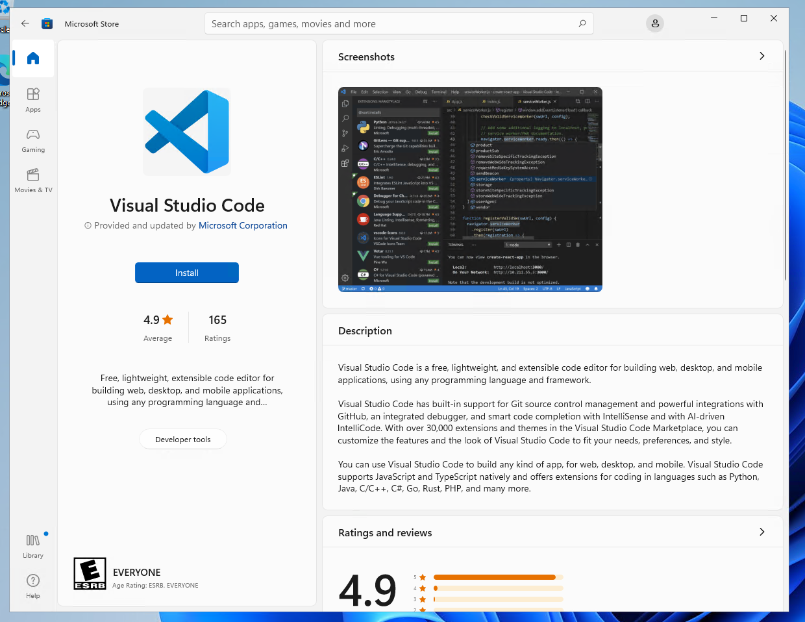
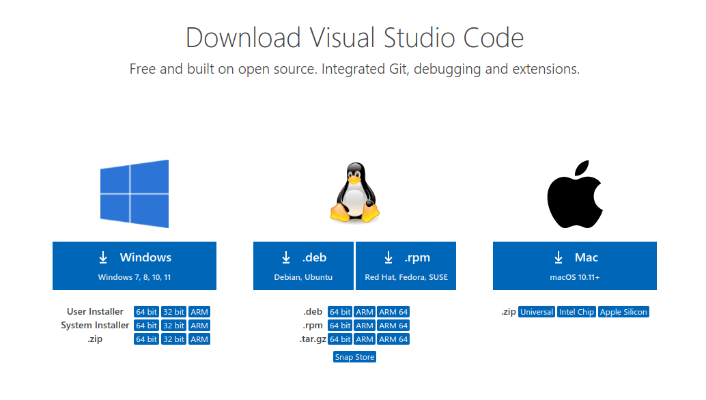
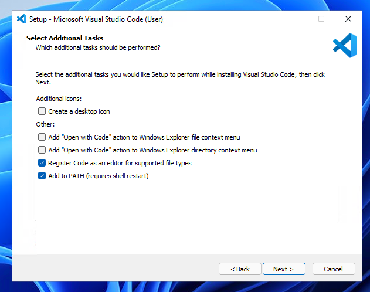
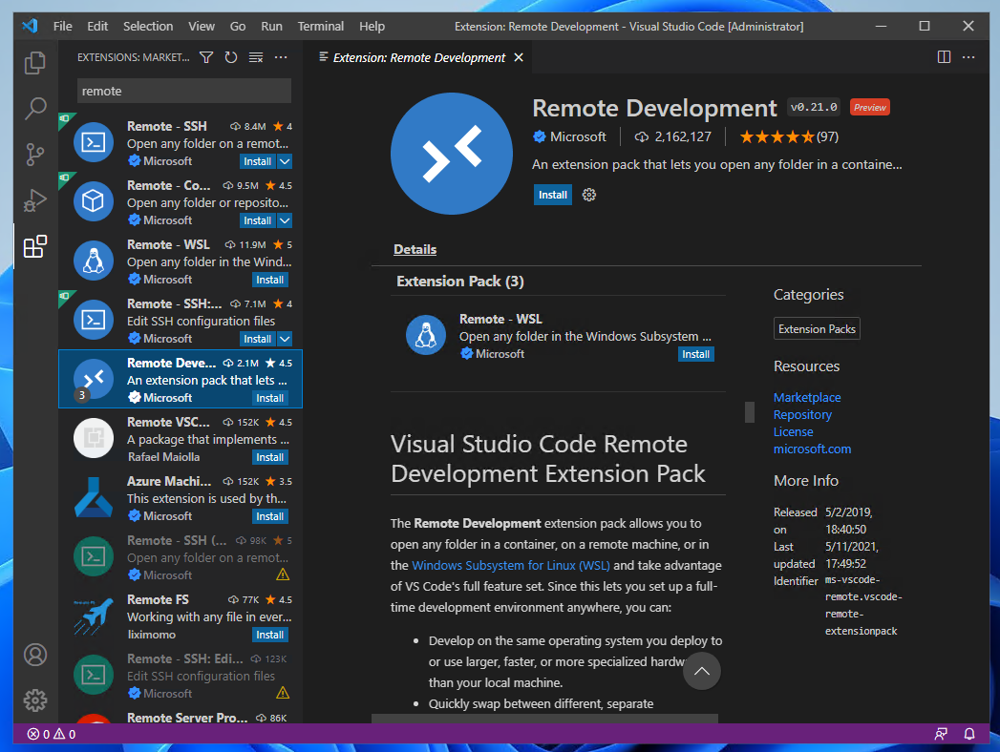
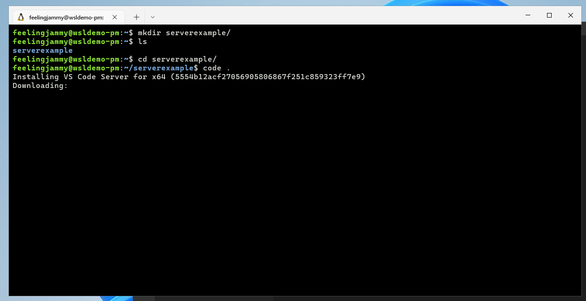
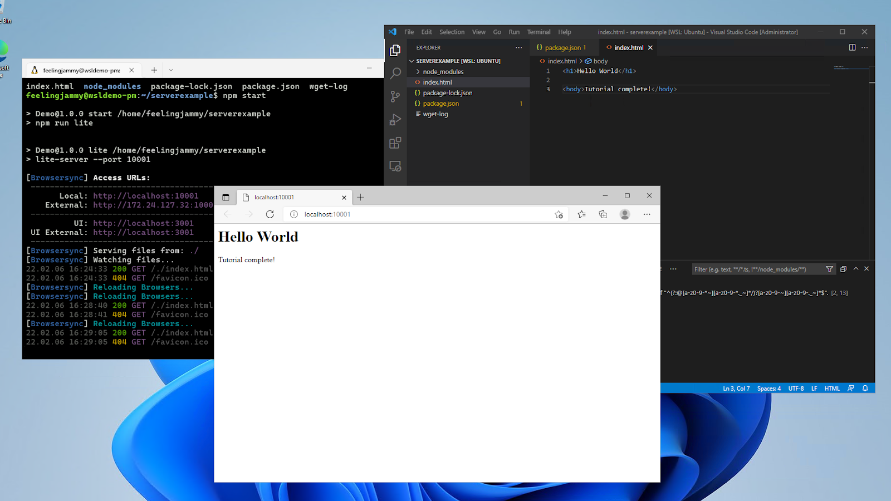

# Working with Visual Studio Code
*Authored by Oliver Smith ([oliver.smith@canonical.com](mailto:oliver.smith@canonical.com))*

The easiest way to access your Ubuntu development environment in WSL is by using Visual Studio Code via the built-in `Remote` extension.

## What you will learn:

* How to set up Visual Studio Code for remote development on Ubuntu on WSL
* How to start a basic Node.js webserver on Ubuntu using Visual Studio Code

## What you will need:

* A PC with Windows 10 or 11
* (Optional) This tutorial uses [Windows Terminal Preview](https://www.microsoft.com/en-us/p/windows-terminal-preview/9n8g5rfz9xk3?activetab=pivot:overviewtab), which you can get from the Windows app store

## Install Ubuntu on WSL2

This tutorial assumes that you already have WSL2 installed with the latest LTS release of Ubuntu.

If not, check out our getting started tutorials for Windows 10 and Windows 11:

* [Install Ubuntu on WSL2](../guides/install-ubuntu-wsl2.md)

Once you have completed the relevant tutorial, the following steps will work on either Windows 10 or 11.

## Install Visual Studio Code on Windows

One of the advantages of WSL is that it can interact with the native Windows version of Visual Studio Code using its remote development extension.

To install Visual Studio Code visit the Microsoft Store and search for `Visual Studio Code`.

Then click `Install`.



Alternatively, you can install Visual Studio Code from the web link [here](https://code.visualstudio.com/Download).



During installation, under the `Additional Tasks` step, ensure the `Add to PATH` option is checked.



Once the installation is complete, open Visual Studio Code.

## Install the Remote Development Extension

Navigate to the `Extensions` menu in the sidebar and search for `Remote Development`.

This is an extension pack that allows you to open any folder in a container, remote machine, or in WSL. Alternatively, you can just install `Remote - WSL`.



Once installed we can test it out by creating an example local web server with Node.js

## Install Node.js and create a new project

Open your WSL Ubuntu terminal and ensure everything is up to date by typing:

` sudo apt update`

And then

`sudo apt upgrade`

Entering your password and pressing `Y` when prompted.

Next, install Node.js and npm:

    sudo apt-get install nodejs

    sudo apt install npm

Press `Y` when prompted.

Now, create a new folder for our server.

`mkdir serverexample/`

Then navigate into it:

`cd serverexample/`

Now, open up your folder in Visual Studio Code, you can do this by typing:

`code .`

The first time you do this, it will trigger a download for the necessary dependencies:



Once complete, your native version of Visual Studio Code will open the folder.

## Creating a basic web server

In Visual Studio Code, create a new file called `package.json` and add the following text ([original example](https://learn.microsoft.com/en-gb/archive/blogs/cdndevs/visual-studio-code-and-local-web-server#3-add-a-packagejson-file-to-the-project-folder))

```json

{
    "name": "Demo",
    "version": "1.0.0",
    "description": "demo project.",
    "scripts": {
        "lite": "lite-server --port 10001",
        "start": "npm run lite"
    }, 
    "author": "",
    "license": "ISC",
    "devDependencies": {
        "lite-server": "^1.3.1"
    }
}
```

Save the file and then, in the same folder, create a new one called `index.html`

Add the following text, and then save and close:

`<h1>Hello World<h1>`

Now return to your Ubuntu terminal (or use the Visual Studio Code terminal window) and type the following to install a server defined by the above specifications detailed in `package.json`:

`npm install`

Finally, type the following to launch the web server:

`npm start`

You can now navigate to `localhost:10001` in your native Windows web browser by using `CTRL+Left Click` on the terminal links.



That’s it!

By using Ubuntu on WSL you’re able to take advantage of the latest Node.js packages available on Linux as well as the more streamlined command line tools.

## Enjoy Ubuntu on WSL!

That’s all folks! In this tutorial, we’ve shown you how to connect the Windows version of Visual Studio Code to your Ubuntu on WSL filesystem and launch a basic Node.js webserver.

We hope you enjoy using Ubuntu inside WSL. Don’t forget to check out our other tutorials for tips on how to optimise your WSL setup for Data Science.

### Further Reading

* [Install Ubuntu on WSL2](../guides/install-ubuntu-wsl2.md)
* [Microsoft WSL Documentation](https://learn.microsoft.com/en-us/windows/wsl/)
* [Setting up WSL for Data Science](https://ubuntu.com/blog/wsl-for-data-scientist)
* [Ask Ubuntu](https://askubuntu.com/)